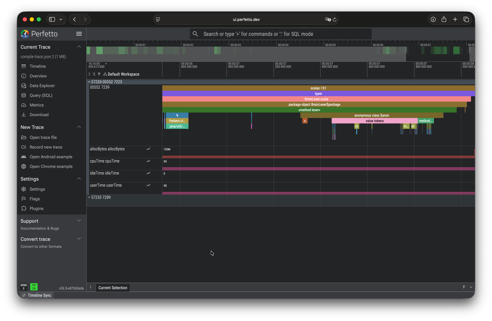
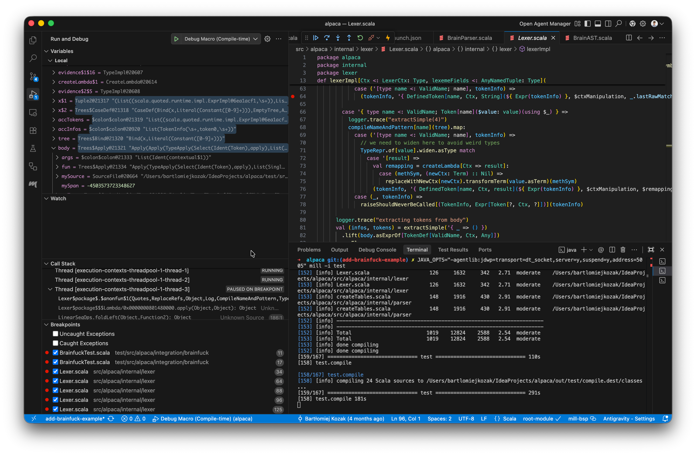
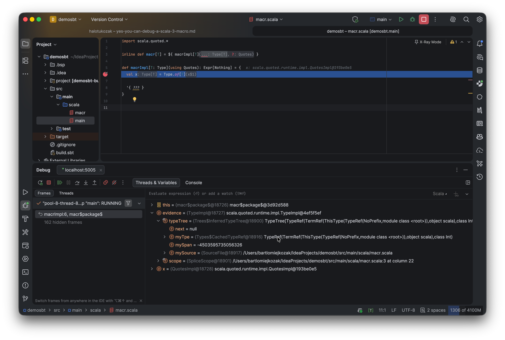

## The State of Scala 3 Macro Docs

There is no good Scala 3 macro book. Most of what I know I picked up from forum threads, release notes or papers.
This post is my attempt to collect everything I've figured out so far, plus the tips that aren't written down anywhere
else.

This post wouldn't exist without my best friend [Bartek](https://www.linkedin.com/in/bartoszbuczek/), who has a knack
for doing impossible things — mostly because nobody told him they were impossible.

## Where to Learn From

### Tutorials

I'd recommend starting with these four. They overlap in places, but each one introduces something the others skip:

- [SoftwareMill — Scala 3 Macros: Tips and Tricks](https://softwaremill.com/scala-3-macros-tips-and-tricks/) — the best
  starting point if you've never touched a macro before.
- [Rock the JVM — A Comprehensive Guide to Scala 3 Macros](https://rockthejvm.com/articles/rockthejvm-scala-3-macros-comprehensive-guide)
  — longest of the four, with worked examples.
- [eed3si9n — Intro to Scala 3 Macros](https://eed3si9n.com/intro-to-scala-3-macros/) — concise, focused on the quote/
  splice mental model.
- [Official Scala 3 Macros Guide](https://docs.scala-lang.org/scala3/guides/macros/index.html) and
  the [Metaprogramming Reference](https://docs.scala-lang.org/scala3/reference/metaprogramming/index.html) — the
  official source.

### Papers

Once the tutorials stop helping, the papers explain *why* the API looks the way it does. They're less scary than they
sound — skim the abstracts and intros first, and dip into the ones that match the question you're currently stuck on:

- [Scala 3 Macros: A Technical Report](https://infoscience.epfl.ch/handle/20.500.14299/193908) — the design rationale.
- [Stojanov, Biboudis et al. — Inlining in Scala 3](https://biboudis.github.io/papers/inlining-scala20.pdf) — how
  `inline` actually works.
- [Stucki et al. — Multi-Stage Programming with Generative and Analytical Macros](https://se.informatik.uni-tuebingen.de/publications/stucki21multistage.pdf)
  — the theoretical foundation for quotes and splices.

### Quotes.scala Is Your Best Friend

You'll spend more time in
[`Quotes.scala`](https://github.com/scala/scala3/blob/main/library/src/scala/quoted/Quotes.scala) than in any tutorial.
Every tree type and every available method is defined there.

Each tree kind follows the same four-part shape: the type, the module object, a `TypeTest` for pattern matching, and
an extension methods trait. For example:

[//]: # (@formatter:off)
```scala 3
/** Tree representing an if/then/else `if (...) ... else ...` in the source code. */
type If <: Term
/** Module object of `type If`. */
val If: IfModule

/** `TypeTest` that allows testing at runtime in a pattern match if a `Tree` is an `If`. */
given IfTypeTest: TypeTest[Tree, If]

/** Makes extension methods on `If` available without any imports. */
given IfMethods: IfMethods

/** Methods of the module object `val If`. */
trait IfModule {
  this: If.type =>
  def apply(cond: Term, thenp: Term, elsep: Term): If
  def copy(original: Tree)(cond: Term, thenp: Term, elsep: Term): If
  def unapply(tree: If): (Term, Term, Term)
}

/** Extension methods of `If`. */
trait IfMethods:
  extension (self: If)
    def cond: Term
    def thenp: Term
    def elsep: Term
    def isInline: Boolean
```
[//]: # (@formatter:on)

Once you spot the pattern, the rest of the reflection API stops being a guessing game. The Scaladoc itself is packed
with hints about invariants, tree shapes and idiomatic usage — far more than the guides on the website.

When `Quotes.scala` runs out, the compiler source is the next stop, e.g. I've learned how
to synthesise an anonymous class by reading
[
`tpd.scala`](https://github.com/scala/scala3/blob/6ac089a2528b67d0011cade2fb0f4d063fc26c74/compiler/src/dotty/tools/dotc/ast/tpd.scala).

### A Note on IDEs

For macro-heavy code, VS Code with Metals has been less painful than IntelliJ. Sometimes (sic!) navigation is better,
error messages are clearer, and there are files that compile fine in Metals but IntelliJ refuses to recognise. Syntax
highlighting breaks on nested quotes; the formatter mangles code around splices. I still use IntelliJ for everything
else.

## Measuring Where the Compiler Spends Time

Slow compiles and outright compiler hangs aren't things you can diagnose with `println`. The built-in profiler shows
you exactly which phase and which expansion is eating the clock.

Enable it via compiler options:

```
-Yprofile-enabled
-Yprofile-trace:<path to output file>
```

This emits a trace in the Chrome/Perfetto format. Load it in [ui.perfetto.dev](https://ui.perfetto.dev) and you get a
flamegraph of phases, macro expansions, and type-check calls:



The option is documented exactly once, in a [3.6.3 release note](https://www.scala-lang.org/news/3.6.3/) — which is
how you find most Scala tooling features, and yes, it's as infuriating as it sounds.

## Print Debugging, but Better

Everyone says `println` is the only way to debug a macro, so I built myself a pile of utilities on top of it. This
one dumps everything the compiler knows about a type into a single error message:

```scala 3
def dbg(using quotes: Quotes, printer: quotes.reflect.Printer[quotes.reflect.TypeRepr])(tpe: quotes.reflect.TypeRepr): Nothing =
  quotes.reflect.errorAndAbort(
    s"""
       |type: ${tpe.show}
       |widen: ${tpe.widen.show}
       |widenTermRefByName: ${tpe.widenTermRefByName.show}
       |widenByName: ${tpe.widenByName.show}
       |dealias: ${tpe.dealias.show}
       |dealiasKeepOpaques: ${tpe.dealiasKeepOpaques.show}
       |simplified: ${tpe.simplified.show}
       |classSymbol: ${tpe.classSymbol}
       |typeSymbol: ${tpe.typeSymbol}
       |termSymbol: ${tpe.termSymbol}
       |isSingleton: ${tpe.isSingleton}
       |baseClasses: ${tpe.baseClasses}
       |isFunctionType: ${tpe.isFunctionType}
       |isContextFunctionType: ${tpe.isContextFunctionType}
       |isErasedFunctionType: ${tpe.isErasedFunctionType}
       |isDependentFunctionType: ${tpe.isDependentFunctionType}
       |isTupleN: ${tpe.isTupleN}
       |typeArgs: ${tpe.typeArgs}
       |""".stripMargin,
    )
```

Or this one, for when you're guessing at an AST shape:

```scala 3
inline def showRawAst(inline body: Any) = ${ showRawAstImpl('{ body }) }

def showRawAstImpl(body: Expr[Any])(using quotes: Quotes): Expr[Nothing] =
  import quotes.reflect.*
  report.error(Printer.TreeStructure.show(body.asTerm.underlyingArgument))
```

`showRawAst(someExpression)` aborts compilation with the raw `Apply(Select(Ident(...), ...), ...)` shape of the
expression. When you don't know which `quotes.reflect` case to match on, it tells you.

## Attaching a Real Debugger

My best friend, Bartek, didn't get the memo that `println` was the only way to debug a macro.

He (and his LLM) treated the compiler as just another
JVM process — attached a debugger, set breakpoints inside our macro implementations, and watched them fire on the
next compile.

Written down like that it sounds obvious. Macros run during compilation, so the program to debug *is* the Scala
compiler. The compile-side recipe is always the same: start the compiler's JVM with `-agentlib:jdwp=...`, whether
you run Mill, sbt or scala-cli. What changes is how you configure the IDE side.



### Starting the Compile with JDWP

The flag:

```
-agentlib:jdwp=transport=dt_socket,server=y,suspend=y,address=5005
```

`suspend=y` pauses the JVM until a debugger connects, so you can attach before anything expands. How to inject the
flag depends on the build tool:

#### mill

```bash
JAVA_OPTS="-agentlib:jdwp=transport=dt_socket,server=y,suspend=y,address=5005" mill -i YourModule.compile
```

#### sbt

```bash
sbt -jvm-debug 5005
```

#### scala-cli

```bash
# stop any running Bloop daemon (otherwise it'll reuse the old JVM without the agent)      
scala-cli --power bloop exit

# compile, passing JDWP args to the new Bloop JVM 
scala-cli compile . --bloop-java-opt "-agentlib:jdwp=transport=dt_socket,server=y,suspend=y,address=5005"
```

All three end up the same way: a Scala compiler sitting on port `5005`, waiting.

### VS Code — launch.json

Add an attach configuration pointing at port `5005`:

```json title=".vscode/launch.json"
{
  "version": "0.2.0",
  "configurations": [
    {
      "type": "scala",
      "request": "attach",
      "name": "Debug Macro (Compile-time)",
      "hostName": "localhost",
      "port": 5005,
      "buildTarget": "YourModuleName"
    }
  ]
}
```

`buildTarget` is the BSP target for the module whose sources contain your breakpoints. Metals lists them in the
status bar; it's usually the module name from your build file.

Set breakpoints, start to compile, then Run -> Start Debugging.

### IntelliJ IDEA — Remote JVM Debug

IntelliJ has no BSP-aware attach config for macros, so use the generic remote debugger:

1. Run -> Edit Configurations -> **+** -> Remote JVM Debug.
2. Host `localhost`, port `5005`, "Attach to remote JVM", command line args for remote JVM auto-filled.
3. Start to compile.
4. Run -> Debug -> your new configuraton.



## Case Closed

There is no official "how to debug a Scala 3 macro" page. Until there is, I hope this one saves someone time.
See ya next time.

## References

- [SoftwareMill — Scala 3 Macros: Tips and Tricks](https://softwaremill.com/scala-3-macros-tips-and-tricks/)
- [Rock the JVM — A Comprehensive Guide to Scala 3 Macros](https://rockthejvm.com/articles/rockthejvm-scala-3-macros-comprehensive-guide)
- [eed3si9n — Intro to Scala 3 Macros](https://eed3si9n.com/intro-to-scala-3-macros/)
- [Official Scala 3 Macros Guide](https://docs.scala-lang.org/scala3/guides/macros/index.html)
- [Metaprogramming Reference](https://docs.scala-lang.org/scala3/reference/metaprogramming/index.html)
- [`Quotes.scala` source](https://github.com/scala/scala3/blob/main/library/src/scala/quoted/Quotes.scala)
- [Perfetto Trace Viewer](https://ui.perfetto.dev)
- [Scala 3.6.3 Release Notes — profiler](https://www.scala-lang.org/news/3.6.3/)
- [scala-cli Debugging Cookbook](https://scala-cli.virtuslab.org/docs/cookbooks/introduction/debugging/)
- [Scala Debug Adapter Protocol](https://github.com/scalacenter/scala-debug-adapter)
